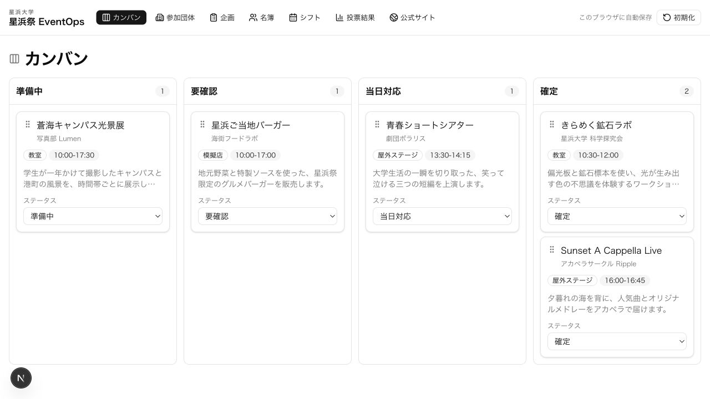
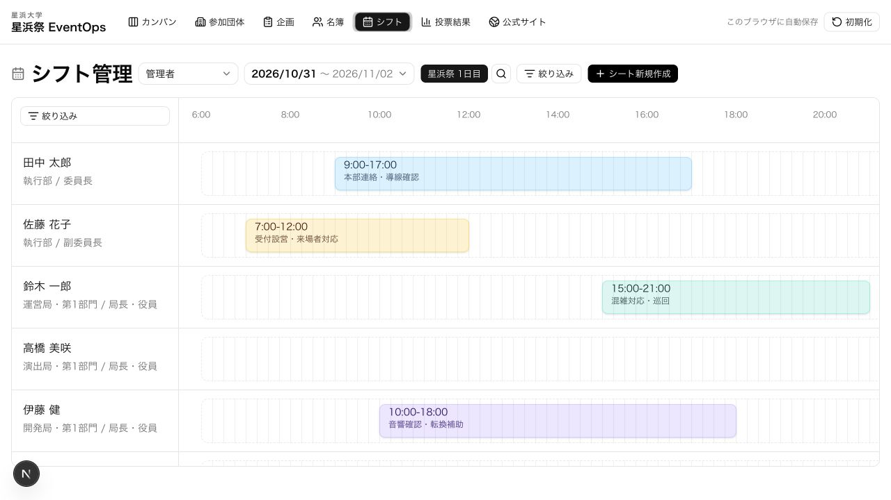

# 星浜祭 EventOps

架空の「星浜大学・星浜祭」を題材にした、大学祭運営の統合管理アプリです。実行委員向けの業務画面と来場者向け公式サイトを同じ企画データでつなぎ、準備から当日の投票までを一つのデモで体験できます。

[公開デモを開く](__DEMO_URL__)

## 解決したい課題

大学祭の準備では、参加団体、企画進行、スタッフ配置、来場者向け情報が別々の表やツールに分散しがちです。その結果、更新漏れや二重入力が発生し、当日の判断にも時間がかかります。

EventOpsは、次の情報を一つのデータフローにまとめます。

- 参加団体と企画の登録・編集
- カンバンによる準備状況の把握
- 実行委員名簿とシフト配置
- 管理データを利用した公式サイト
- 来場者の投票、マイ投票、投票結果

## 利用フロー

1. 「参加団体」と「企画」で出展情報を管理します。
2. 「カンバン」で企画を準備中・要確認・当日対応・確定へ移動します。
3. 「名簿」と「シフト」で当日の担当者を配置します。
4. 「公式サイト」の企画一覧から詳細ページを開き、企画に投票します。
5. 来場者は「マイ投票」、運営側は「投票結果」で投票内容を確認します。

初期画面はカンバンです。編集内容と投票はブラウザへ自動保存され、右上の「初期化」からいつでもサンプル状態へ戻せます。

## スクリーンショット

### 企画進行を俯瞰するカンバン



### 時間軸で配置するスタッフシフト



### 同じ企画データを使う来場者向け公式サイト


## 技術構成

- Next.js 16.2 / App Router / Static Export
- React 19.2 / TypeScript 5
- Tailwind CSS 4 / Base UI / shadcn
- Browser localStorage
- Vitest / Testing Library
- ESLint / GitHub Actions

設計資料:

- [システム構成](docs/system-architecture.md)
- [データモデル](docs/er.md)

## ローカル実行

Node.js 22 と npm 10.8.1 を使用します。

```bash
nvm use
npm ci
npm run dev
```

ブラウザで `http://localhost:3000` を開いてください。

```bash
npm run lint
npm test
npm run build
```

## デモ上の制約

- データは端末・ブラウザごとに保存され、別端末とは共有されません。
- 投票はログインを伴わないデモ仕様で、1端末につき各企画1票です。
- 管理画面と公式サイトはポートフォリオ用に同一アプリ内へ収録しています。
- 実在の大学、団体、人物、イベントとは関係ありません。
- 本運用では認証、サーバー側の認可、データベース、監査ログ、不正投票対策が必要です。
