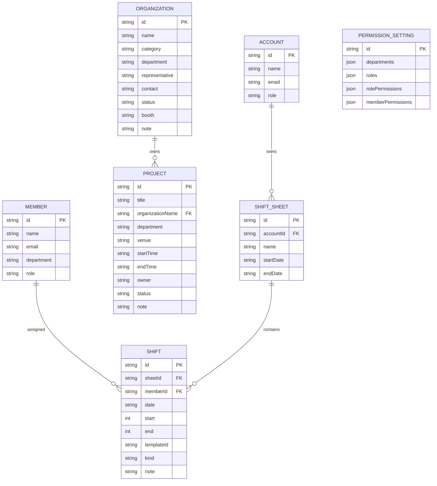

# ER図

```mermaid
erDiagram
  ACCOUNT {
    string id PK
    string name
    string email
    string role
  }

  MEMBER {
    string id PK
    string name
    string email
    string department
    string role
  }

  ORGANIZATION {
    string id PK
    string name
    string category
    string department
    string representative
    string contact
    string status
    string booth
    string note
  }

  PROJECT {
    string id PK
    string title
    string organizationName FK
    string department
    string venue
    string startTime
    string endTime
    string owner
    string status
    string note
  }

  SHIFT_SHEET {
    string id PK
    string accountId FK
    string name
    string startDate
    string endDate
  }

  SHIFT {
    string id PK
    string sheetId FK
    string memberId FK
    string date
    int start
    int end
    string templateId
    string kind
    string note
  }

  PERMISSION_SETTING {
    string id PK
    json departments
    json roles
    json rolePermissions
    json memberPermissions
  }

  ORGANIZATION ||--o{ PROJECT : owns
  MEMBER ||--o{ SHIFT : assigned
  ACCOUNT ||--o{ SHIFT_SHEET : owns
  SHIFT_SHEET ||--o{ SHIFT : contains
```
