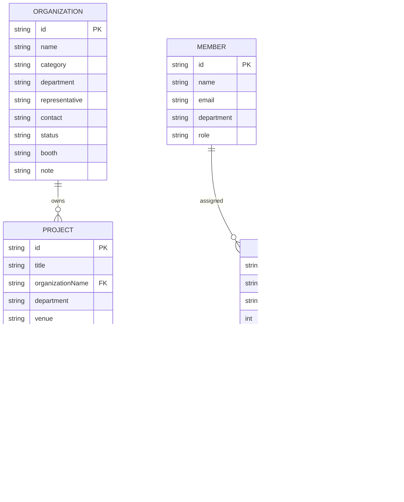

# データモデル

```mermaid
erDiagram
  MEMBER {
    string id PK
    string name
    string email
    string department
    string role
  }

  ORGANIZATION {
    string id PK
    string name
    string category
    string department
    string representative
    string contact
    string status
    string booth
    string note
  }

  PROJECT {
    string id PK
    string title
    string organizationName FK
    string department
    string venue
    string startTime
    string endTime
    string owner
    string status
    string note
  }

  SHIFT_SHEET {
    string id PK
    string name
    string startDate
    string endDate
  }

  SHIFT {
    string id PK
    string memberId FK
    string date
    int start
    int end
    string templateId
    string kind
    string note
  }

  LOCAL_VOTE {
    string projectId FK
  }

  ORGANIZATION ||--o{ PROJECT : owns
  MEMBER ||--o{ SHIFT : assigned
  SHIFT_SHEET ||--o{ SHIFT : contains
  PROJECT ||--o| LOCAL_VOTE : selected
```

デモ版では上記をブラウザ内の単一データセットとして保存しています。本番化する場合はID参照へ正規化し、投票者と投票日時を追加します。
