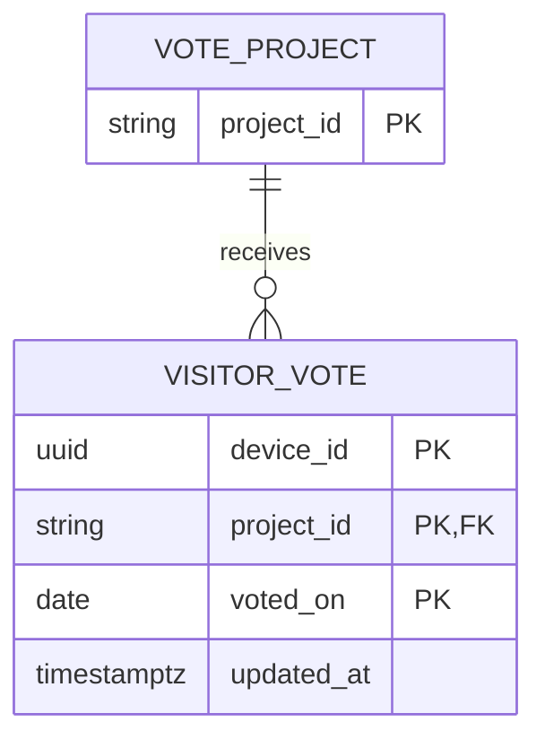

# 投票データ

```mermaid
erDiagram
  VOTE_PROJECT ||--o{ VISITOR_VOTE : receives

  VOTE_PROJECT {
    string project_id PK
  }

  VISITOR_VOTE {
    uuid device_id PK
    string project_id PK, FK
    date voted_on PK
    timestamptz updated_at
  }
```

運営データはDBへ保存しません。投票日はサイトプレビューで選択した本祭日です。同じ端末から同じ企画への投票は、投票日ごとに1票までです。
