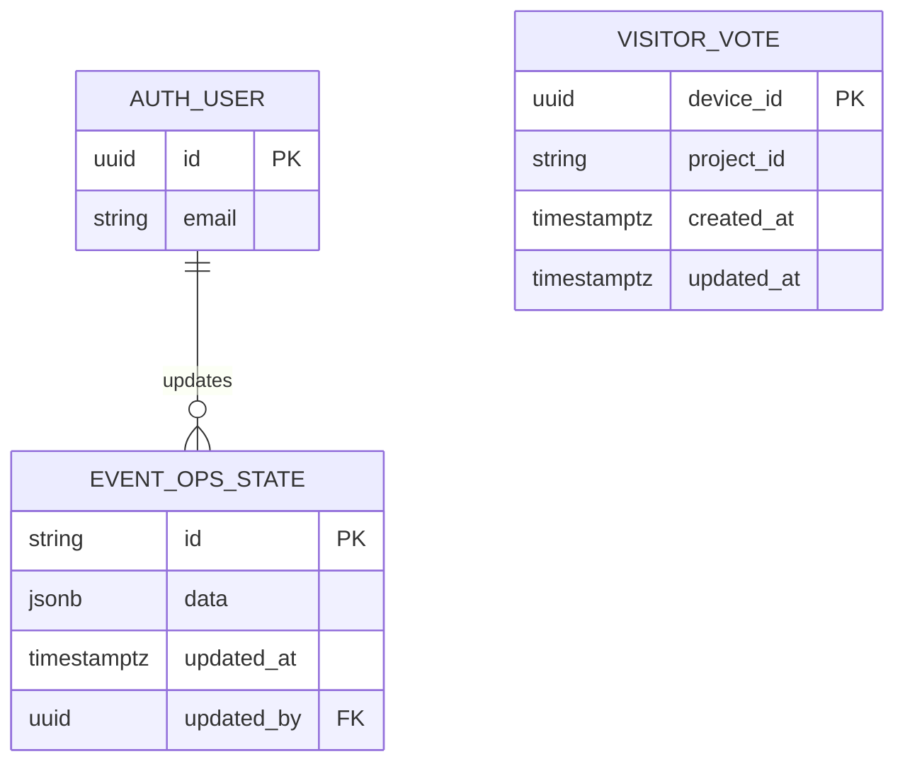
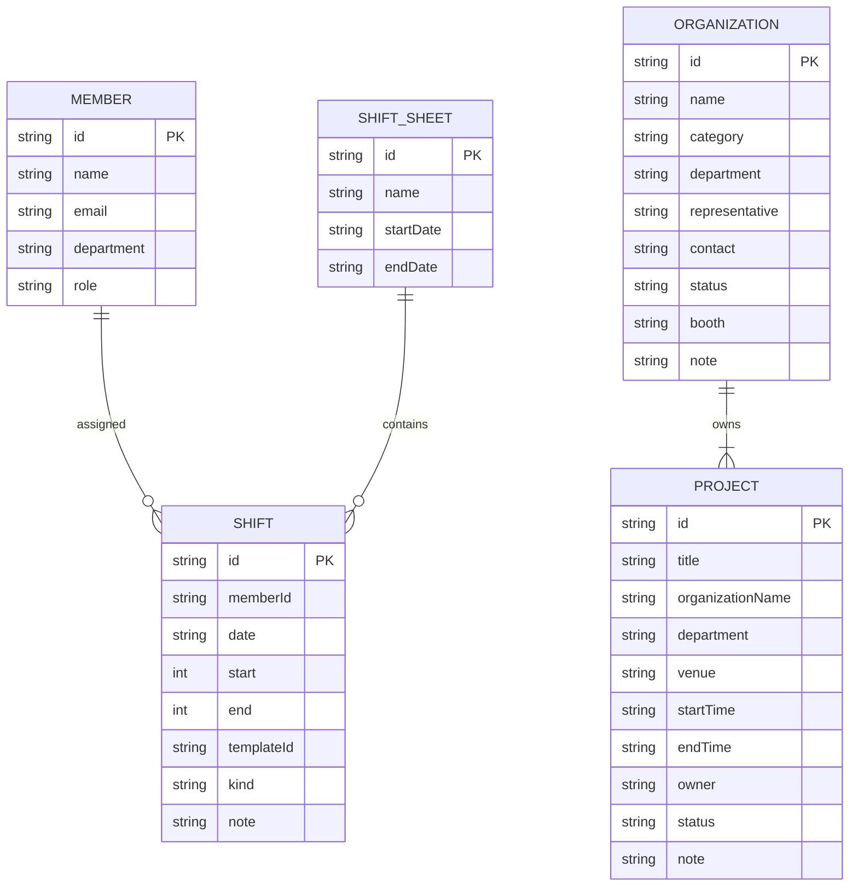

# データモデル

```mermaid
erDiagram
  AUTH_USER {
    uuid id PK
    string email
  }

  EVENT_OPS_STATE {
    string id PK
    jsonb data
    timestamptz updated_at
    uuid updated_by FK
  }

  VISITOR_VOTE {
    uuid device_id PK
    string project_id
    timestamptz created_at
    timestamptz updated_at
  }

  AUTH_USER ||--o{ EVENT_OPS_STATE : updates
```

`event_ops_state.data`には、MVPの画面構造に合わせた次の共有データを保存します。

```mermaid
erDiagram
  MEMBER ||--o{ SHIFT : assigned
  ORGANIZATION ||--|{ PROJECT : owns
  SHIFT_SHEET ||--o{ SHIFT : contains

  MEMBER {
    string id PK
    string name
    string email
    string department
    string role
  }

  ORGANIZATION {
    string id PK
    string name
    string category
    string department
    string representative
    string contact
    string status
    string booth
    string note
  }

  PROJECT {
    string id PK
    string title
    string organizationName
    string department
    string venue
    string startTime
    string endTime
    string owner
    string status
    string note
  }

  SHIFT_SHEET {
    string id PK
    string name
    string startDate
    string endDate
  }

  SHIFT {
    string id PK
    string memberId
    string date
    int start
    int end
    string templateId
    string kind
    string note
  }
```

投票は集計・一意制約・匿名書き込みを運営データと分離するため、専用テーブルへ正規化しています。
