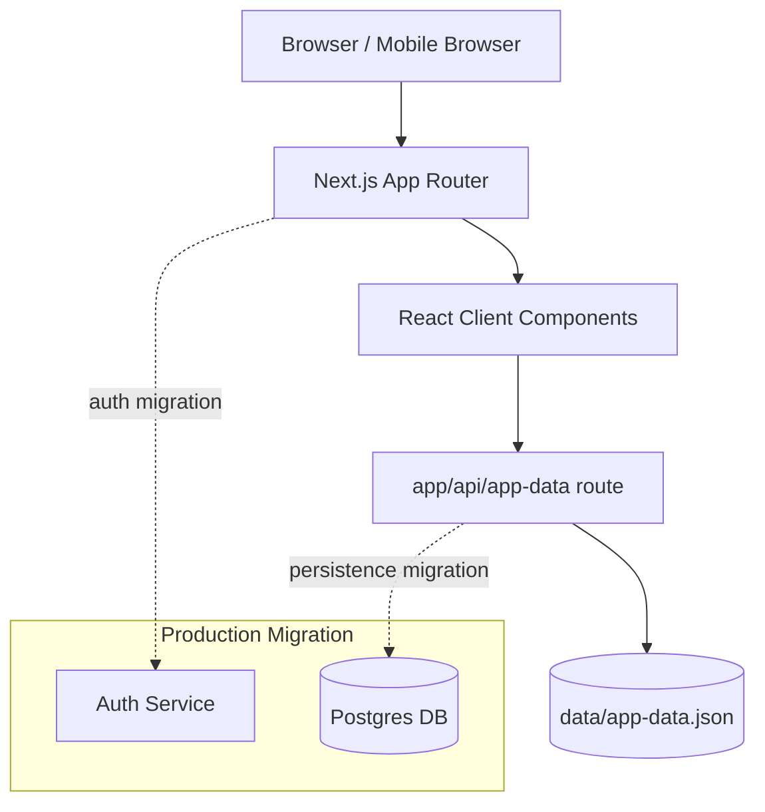

# システム構成図

```mermaid
flowchart TB
  Browser[Browser / Mobile Browser]
  Next[Next.js App Router]
  UI[React Client Components]
  API[app/api/app-data route]
  JSON[(data/app-data.json)]
  FutureAuth[Auth Service]
  FutureDB[(Postgres DB)]

  Browser --> Next
  Next --> UI
  UI --> API
  API --> JSON

  subgraph FutureProduction[Production Migration]
    FutureAuth
    FutureDB
  end

  Next -. auth migration .-> FutureAuth
  API -. persistence migration .-> FutureDB
```

## 現状

- 認証はローカルの簡易ログインです。
- 永続化は JSON ファイルです。
- UI はクライアントコンポーネント中心です。

## 移行後の想定

- 認証サービスでセッション管理を行う。
- Supabase Postgres 等にデータを正規化して保存する。
- API Route / Server Actions から DB にアクセスする。
