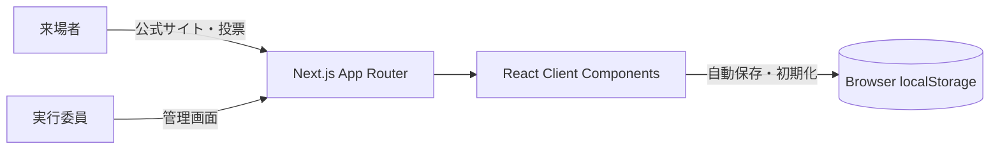

# システム構成

## デモ版の設計

- Next.js の静的エクスポートとして配信する。
- 参加団体、企画、名簿、シフト、投票履歴は同一ブラウザの `localStorage` に保存する。
- 管理画面で編集した企画情報を、公式サイトと投票結果へ即時反映する。
- 「初期化」操作でシードデータへ戻せる。

## 本運用へ拡張する場合

- Auth.js や Supabase Auth で実行委員と来場者を識別する。
- PostgreSQL へイベントデータと投票を保存する。
- API または Server Actions で認可、入力検証、集計を行う。
