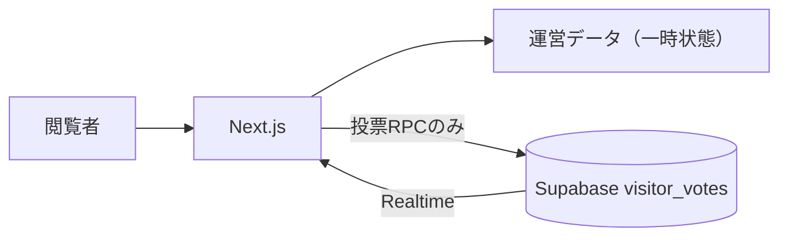

# システム構成

```mermaid
flowchart LR
  User["閲覧者"] --> App["Next.js"]
  App --> Local["運営データ（一時状態）"]
  App -->|"投票RPCのみ"| Votes[("Supabase visitor_votes")]
  Votes -->|"Realtime"| App
```

- ログイン・CMS・運営データ保存なし
- Supabaseは投票だけ
- 匿名ユーザーは投票RPCと結果参照だけ可能
- 公開サイト本体は別リポジトリ
