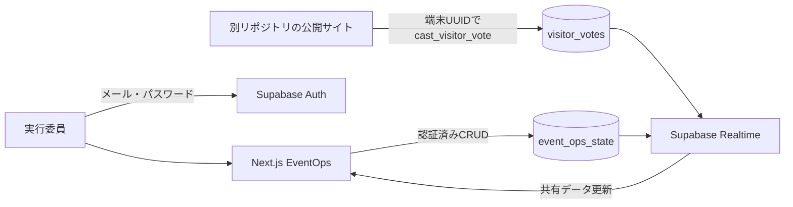

# システム構成

## 認証と認可

- Supabase Authでログインしたユーザーだけが運営データを閲覧・変更できます。
- 全ログインユーザーは同じ権限です。
- ブラウザへ渡すPublishable keyだけを使用し、Row Level Securityで認可します。
- `service_role`キーはクライアントへ渡しません。

## リアルタイム同期

- 運営データは`event_ops_state`のJSONBへ保存します。
- 管理アプリは`event_ops_state`と`visitor_votes`をRealtime購読します。
- 変更は350msのデバウンス後に保存し、別端末へ即時反映します。
- 運営データのローカル保存へのフォールバックは行いません。

## 投票

- 公開サイトはログインを必要とせず、`cast_visitor_vote` RPCだけを呼び出します。
- `device_id`を主キーにすることで有効票を1端末1票に制限します。
- 同じ端末が投票先を変更した場合は既存行を更新します。
